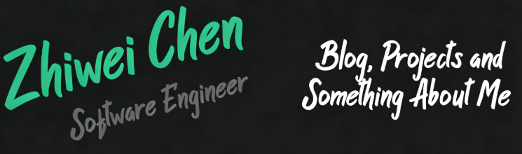

<h1 align="center">
  Hi, I'm Chen Zhiwei!
  
</h1>

  
  &nbsp;&nbsp;
  
  &nbsp;&nbsp;
  
  &nbsp;&nbsp;
  

  <em>
    Artificial Intelligence at 
    <a href="https://www.nuist.edu.cn/" 
      title="Nanjing University of Information Science and Technology"
      target="_blank" rel="noopener noreferrer">
      NUIST
    </a>
    
     
    Applied Computing at 
    <a href="https://www.setu.ie/" 
      title="South East Technology University"
      target="_blank" rel="noopener noreferrer">
      SETU
    </a>
    
  </em>

  

<h2 align="center">
  A little more about me...
  
</h2>

  <pre style="white-space:pre-wrap; overflow:auto; padding:12px; border-radius:12px;">
<code class="language-javascript">const chen = {
  pronouns: ["she", "her"],
  researchInterests: ["Computer Vision", "Weakly Supervised Learning"],
  currentFocus: ["Zero-Shot Learning","Positive-Unlabeled (PU) Learning","Vision-Language Models"],
  favoriteMetric: "anything that is not accuracy",
  coffeeLevel: "depends on deadline",
  biggestFear: "studying & coding",
  lifeMotto: "Starting hard doesn’t promise a sweet ending — but starting sweet is already sweet."
};</code>
  </pre>

<h2 align="center">
  🔧 Technologies & Tools
</h2>

  
  
  

   

  
  
  
  

   

  
  
  
  
  

<h2 align="center">
  📚 Open Source Projects
</h2>

  <a href="https://github.com/Agoni-Y/Cloud-Computing"><b>Cloud-Computing</b></a>: Experiments about Docker and Kubernetes

<h2 align="center">
  &#x270d; Blog & Writing
</h2>

  <a href="https://blog.csdn.net/qq_40828881/article/details/143438155?spm=1001.2014.3001.5501"><b>SE Midterm Review</b></a>: Key Points of Course "Software Engineering" 

